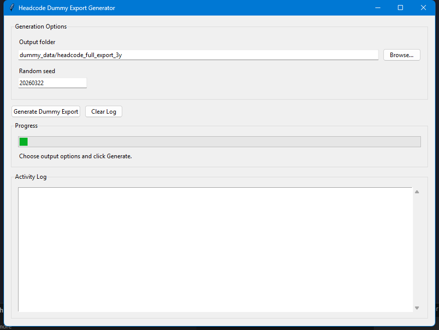
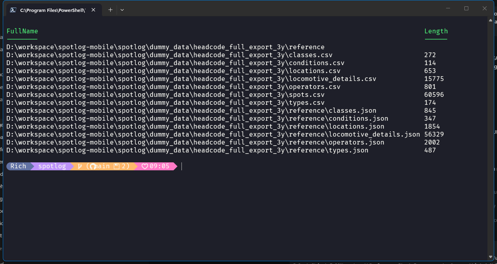

# Headcode Dummy Export Generator

Generate a realistic multi-year dummy Headcode export set for testing and demos.

## What this tool creates

The generator outputs:

- `spots.csv` (matching the app FULL-export spot schema)
- `classes.csv`
- `types.csv`
- `conditions.csv`
- `locations.csv`
- `operators.csv`
- `locomotive_details.csv`
- `reference/classes.json`
- `reference/types.json`
- `reference/conditions.json`
- `reference/locations.json`
- `reference/operators.json`
- `reference/locomotive_details.json`

## Run as GUI (recommended for end users)

```bash
python tool/headcode_dummy/generate_headcode_dummy_export.py --gui
```

### GUI flow

1. Choose an **Output folder**.
2. Optionally change **Random seed**.
3. Click **Generate Dummy Export**.
4. Watch progress and file counts in the **Activity Log**.

## Run as CLI

```bash
python tool/headcode_dummy/generate_headcode_dummy_export.py
```

Optional:

```bash
python tool/headcode_dummy/generate_headcode_dummy_export.py --output-dir dummy_data/headcode_full_export_3y --seed 20260322
```

## Screenshots

Generator GUI:



Example generated output listing:


